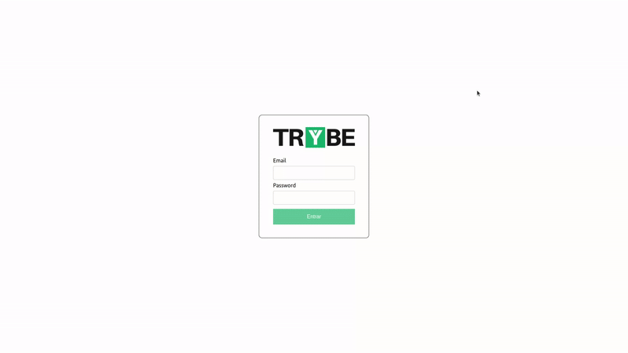

<h1 align="center">Project Trybe Wallet</h1>

<p align="center">✔️ Concluded</p>

## 💻 Instalando o projeto

Clone o repositório:

```
git clone git@github.com:lramos33/project-trybe-wallet.git
```

Acesse a pasta do repositório

```
cd project-trybe-wallet
```

Instale as dependências:
```
npm install
```

Execute a aplicação
```
npm start
```

## 🚀 Habilidades

- Criar um store Redux em aplicações React;
- Criar reducers no Redux em aplicações React;
- Criar actions no Redux em aplicações React;
- Criar dispatchers no Redux em aplicações React;
- Conectar Redux aos componentes React;
- Criar actions assíncronas na React que faz uso de Redux.

## 🔧 Desenvolvimento

Nesse projeto foi desenvolvido uma carteira de controle de gastos com conversor de moedas, ao utilizar essa aplicação um usuário deverá ser capaz de:

- Adicionar, remover e editar um gasto;
- Visualizar uma tabelas com seus gastos;
- Visualizar o total de gastos convertidos para uma moeda de escolha.



## 📝 Requisitos do projeto

- [x] 1. Crie uma página inicial de login;

- [x] 2. Crie uma página para sua carteira;

- [x] 3. Crie um header para a página da carteira;

- [x] 4. Desenvolva um formulário para adicionar uma despesa;

- [x] 5. Implemente a lógica para preencher as opções do campo "Moedas" buscando as siglas da API;

- [x] 6. Desenvolva uma tabela com os gastos;

- [x] 7. Implemente a lógica para que a tabela seja alimentada pelo estado da aplicação;

- [x] 8. Crie um botão para deletar uma despesa da tabela.

##

<div align="center">
  
  
  
</div>
